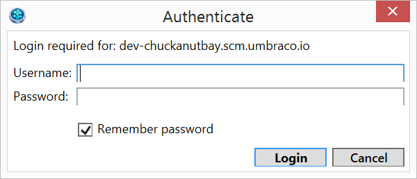
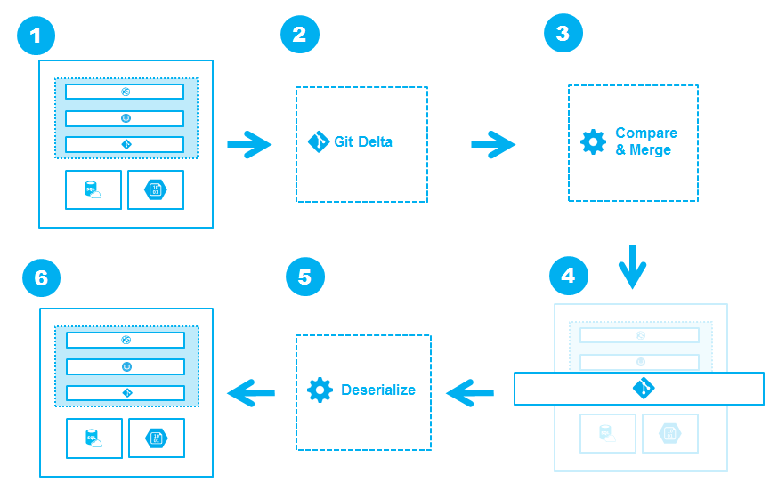

#Working with a local clone of an umbraco.com site
From the umbraco.com portal [www.umbraco.io](www.umbraco.io) copy your dev site’s **HTTPS Clone Url** and then clone the site using your favorite Git client.  We like [SourceTree](http://www.sourcetreeapp.com/) or [Git Extensions](http://code.google.com/p/gitextensions/).  We'll use SourceTree in this example.  Here are the steps to clone your site:

1. Copy the HTTPS Clone Url from the portal for your dev site

2. From SourceTree select Clone/New and paste the Url in the Source Path box

3. Set your Destination Path to where you keep your local work
4. You’ll be prompted to log in, use the same credentials as you use for the portal

5. Click Clone

Now you have an exact copy of your umbraco.com dev site locally.  We like to use Microsoft WebMatrix when working locally, but you can use Visual Studio or another development tool or web server of course.  When you run your local site for the first time you’ll notice that umbraco updates the site.  Wait until this process completes as it also creates the local SqlCE database for your site.

Once your local site is running, any edits you make you make using the umbraco back office will be picked up by umbraco.  This includes umbraco items like document types and also items like CSS file you add and even your own custom dll’s.

Once you have your local site just how you want it you’ll Git Commit the changes you’ve made and Git Push them to your umbraco.com site for deployment.  We’ll do this using SourceTree again.  So the steps to deploy a locally cloned umbraco.com site that has been editied locally to your umbraco.com project's dev site are:

1. In SourceTree review the File Status tab and Stage all files by checking the box.  
2. You can unstage any files in _/app_data/TEMP/_ , _/app_data/umbraco.sdf_, _/app_data/umbraco.config_, and other temporary files you may be using.  These files should be ignored by umbraco and your Git client as we've added a _.gitignore_ file when you first cloned your site.  But if you changed this file, you'll need to manually ignore the above directories and files.
3. Select Commit and enter a commit message
4. Click the Commit button
5. Now select the Push option - which will have a number (of commits) displayed
6. Make sure you have the master branch selected (this is the only one that will get deployed) and click the OK button
7. You may wish to check the Show All Output box so that all messages from your site are displayed
8. Once the push and deployment is complete you will see a Deployment Successful message in the output window
9. Congratulations!  You just did a remote site deployment.

Now, when you login to your dev site you’ll notice all the items you created locally are present.  You can review these updates, and make more as needed.  When you’re ready to deploy your live site, you only need to use the Deploy to Live option from the umbraco.com portal.

If your deployment contains lots of changes it can take a few minutes for umbraco.com to process all of these and to create the items in your dev site.

##What happens when I do a deployment?
Umbraco.com deployments involve several different parts - Git, Kudu, and Courier core.  Each of these does the deployment work so you don't have to.  The process of a deployment looks like this.

When you want to move changes you;ve made from one environment to another, that process is what we call a deployment. A deployment can be anything from moving a complete website into production, moving a small feature update from development to staging for QA or moving a new content section from staging to live.

A deployment is initated from the umbraco.com portal by clicking the "Deploy to ..."" button for an Environment. As a part of a deployment you can create a description of the deployment for historical tracking - for instance “Rolling out the Dutch content section” - which is then shown in the project's  activity stream.

##There are three types of deployments
1. **Full Deployment** Move all changes from one environment to another
2. **Content Deployment** Move all or some content changes. This is typically done by Content Editors making updates in the staging environment.
3. **Non-Content Deployment** Move all changes, except Content. This moves Assets, Code and other file-based content from one environment to another and is typically used by Developers to add or update features.

Once a Deploy is initiated, Umbraco as a Service will compare the Git Repository of the source Environment with the target Environment. This process is technically called a “Git Push”. In that process Git will merge the selected changes from the source Environment, into the target Environment. Once the target Environment is updated, Umbraco as a Service will Deserialize all Content objects ensuring that both Implementation and Content changes are updated on the target.

If there’s a conflict that cannot be automated, Umbraco as a Service will pick the Implementation changes from the source environment and the Content changes from target environment.

Note:  If you have more than "a few" media items see our recommendations for working with [media in umbraco.com](/setup/media.md).  