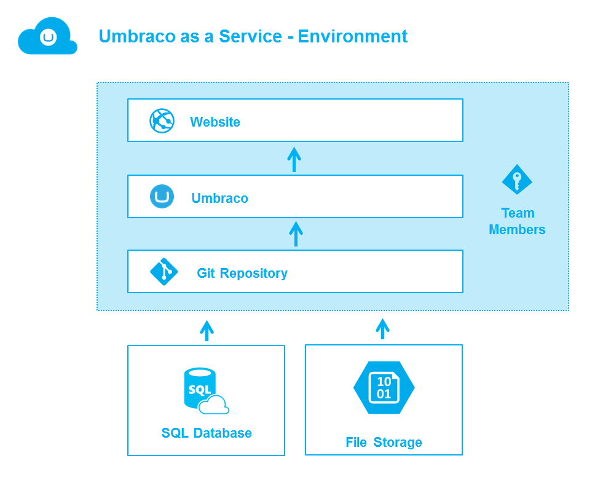
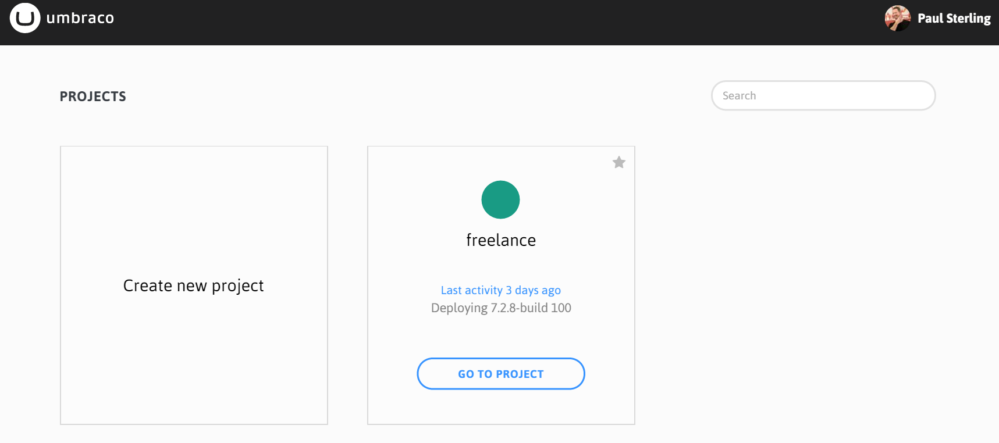
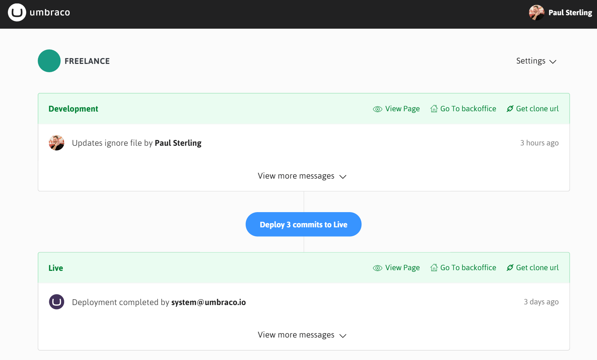

#Welcome to Umbraco.com
We're excited you have decided to use umbraco.com!

###What's up with the name umbraco.com?
Since umbraco.com _is_ Umbraco we thought we'd stick with a name that describes what it is.  So there you go.  We also like to call it just ".com".

## Projects and Sites
In umbraco.com we organize your work into projects which are made of sites, teams, settings, and other related resources like databases and file storage.  In a Trial project you have just one site with a team of one.  But with an Agency project you have three sites (development, staging, live), a team of many, and other items.  But always you start with a project and then, depending on what you want to do, you'll use a site from that project.

For developers, you will use the development site to create and test your code.  You may even clone the development site to your local machine to work there and then, once things are just how you like, deploy your changes to the development site.  See more about this in the [deployment section](/Deployment/index.md).

For content editors, you will either use the staging site or the live site to create and edit your content.  If you author your content in your staging site you'll also deploy this content to your live site.  And developers can always restore to the latest content in the development or local sites.

##Finding your Umbraco Project
To navigate to your site, simply log in to the umbraco.com portal and then click on Projects then the project you want to use.

We create your site’s Url using the name you used when you created the site, then we add _umbraco.io_.  So your site’s Url will look something like _snoopy.umbraco.io_ and your site’s Umbraco back office Url will look something like _snoopy.umbraco.io/umbraco_.  You'll find all sites for a project listed on the Project page.

##Logging in to Umbraco
With the Trial version of umbraco.com you need to log in to work with the Umbraco back office and also to view your site.  The user name and password for both locations are the same as the user name and password you use for the portal.  Once you upgrade to any of the non-Trial versions you’ll no longer need to login to view your live site but, of course, will still need to log in to the back office.

From your site’s Project page select the *Go To Backoffice* link to login to the back office and the *View Page* link to view your site.

##Making changes to your site
This is where you get to make your Umbraco site your own.  Umbraco is built using web standards - things like Html, css, and JavaScript.  You’ll find the Html that makes up the Templates for your site in the Umbraco back office Settings section, under the Templates tree.  This is plain-old-html, so feel free to change or replace what’s there.  The same goes for your site’s Css (it’s in the Stylesheets tree) and the JavaScript (yup, in the Scripts tree).  

##Starting with a Baseline
Beyond the basics of creating a new project, you may wish to start with a Baseline project.  Read more about Baselines and how they work [Baseline Projects](baseline.md).
 
