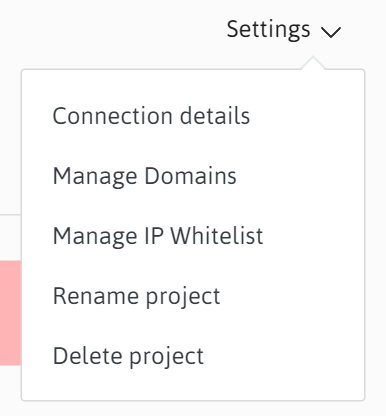
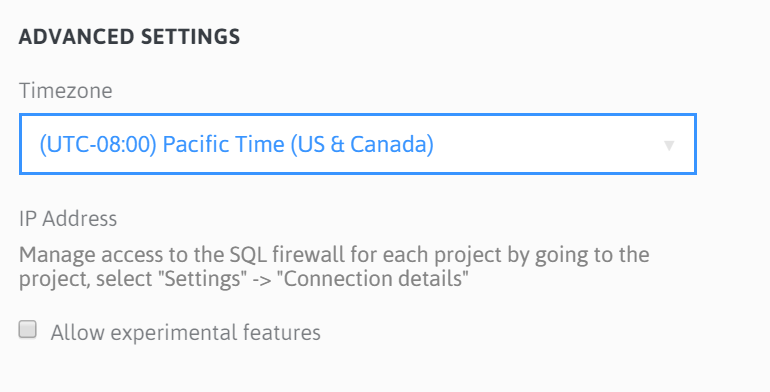

#Set Up
Now that you've created a project there are a few things you may want to do to make working with your project easier.  As you get ready to lauch your live site there are some other considerations to take into account as well.

Most of the set up can be accomplished by using the options from your project's Settings drop down.  Some of the setup applies to all of your projects, so you'll make these updates from your profile section.

##Naming a Project
This is a very personal choice of course.  If you didn't manage to get just the right name the first time, you can always rename your project using the Settings > Rename project option. Heed the warnings before you do this.  

Updating a project name will also update *all* of the project's Urls for the sites and the git repositories.  That means that any links you have to the sites will be broken until you update them.  Fair warning, use with caution. 

##Deleting a Project
This does what it says.  Once you've confirmed deletion of a project it is permanently removed as are all data, media, databases, configuration, setup, and domain bindings.  So, make sure this is what you want.

##Domains (Hostname binding) 
You can bind any hostname to your sites that you like.  Keeping in mind, of course, that the hostname will need to have a DNS entry so that it resolves to the umbraco.io service.

You can add as many domains as the project's plan allows. Once you add a domain here makes sure to update the hostame DNS entry to resolve to the umbraco.io service. We recommend setting an ALIAS record for your site's root domain (e.g. mysite.umbraco.io), rather than an A record for the umbraco.io service IP address.  Check with your DNS host or domain registrar for details on how to configure this for your domain.

##SSL Certificates
You can apply SSL certificates to your live site by uploading them from the Manage Domains page.  Your certificates need to be .pfx format and must be set to use a password.  Each certificate can then be bound to a hostname you have already added to your site.  Make certain you use the hostname you will bind the certificate to as the common name (CN) when generating the certificate.

##IP Whitelist
You can specific IP addresses to the whitelist to automatically allow any client from these addresses to access your development or staging sites without the initial authorization dialog.  This can reduce the amount of times you or your team wil need to enter your credentials in order to access your sites.  

As with all things security related, make sure you use this feature judiciously as it will allow access to your Umbraco backoffice login page without requiring the initial authentication.  Of course, the Umbraco backoffice will still require authentication.

#Profile Settings
##Timezones
From your profile settings you can set your timezone.  This applies to the disply of status messages in the umbraco.io portal and makes it easier to determine the actual time a particular status was created.

##Experimental Features
You can enable the availability of experimental features for your projects.  This includes features that may not be functionaly complete and are not supported by Umbraco HQ.  We recommend enabling this only if you fully understand the feature you will be using or are strictly using the project as a test.

#Working locally
For more on how to work with a local clone of your site see the [Working Local documentation.](/deployment/working-local.md)
