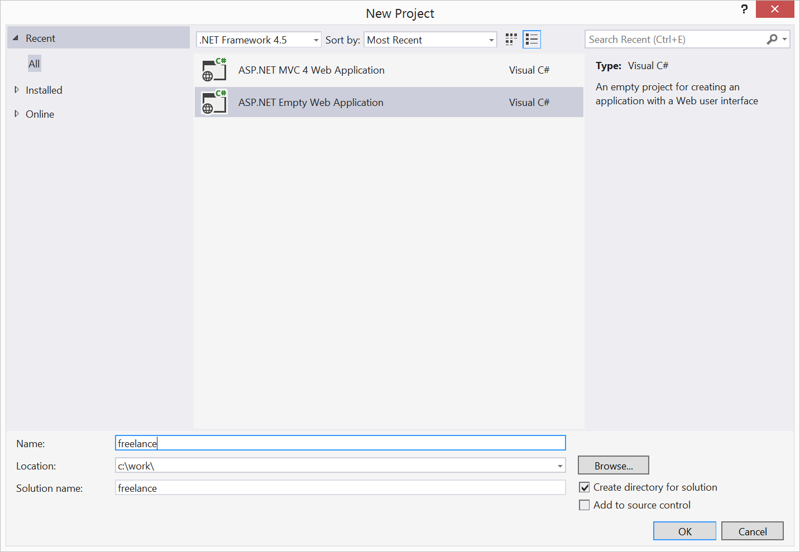

#Working with your site in Visual Studio
Working with your umbraco.io site in Visual Studio is no different than working with any other Umbraco site in Visual Studio.  There are a few considerations to take into account when first setting up, but the process of developing Umbraco websites with Visual Studio is identical.

##The Deployment repository
An important concept in regard to the git repository that is part of your umbraco.io site is that the repository is a *deployment* repository and not a *source code* repository.  It is not intended to replace whatever source code repository you currently use (GitHub, BitBucket, etc.). 

While you will commit all code except compiled dll's to your source code repository you treat the deployment repository differently in that you commit only the compiled dll's and no source code or project files.  Of course, if you don't use compiled code but rather code files in /app_code/ or /app_plugins/ this is the same with both types of repositories.

##Create a new project
In Visual Studio create a new project, selecting the Empty MVC4 Web Application option.

##Add Your site files
If you haven't already, clone your development site to your local machine.  

- Copy all of your site files and folders into the project folder you just created. 
- Include the /.git folder
- Check the *Show all files* option in Visual Studio
- Include all folders and files in your project and save

##Update .gitignore
You may need to add a few entries to your .gitignore file so they are not deployed to your umbraco.io site.  For example, you can add these to your .gitignore file (you may have more to add as well):

- Properties/
- Web.Debug.config
- Web.Release.config
- *.csproj

You should also exclude any folders that contain only source code.  Folders such as /Controllers or /Models and any custom code you have are good examples.  You should not add the /.git folder if that is an option.

Make sure you then commit your updated .gitignore file to your local umbraco.io repository.  It is important that you do not deploy any .csproj (or .vbproj, etc.) files to your site.  If you do your site may become unresponsive while the deploy proces attempts to parse the file contents.

##Getting Ready to deploy your updates
