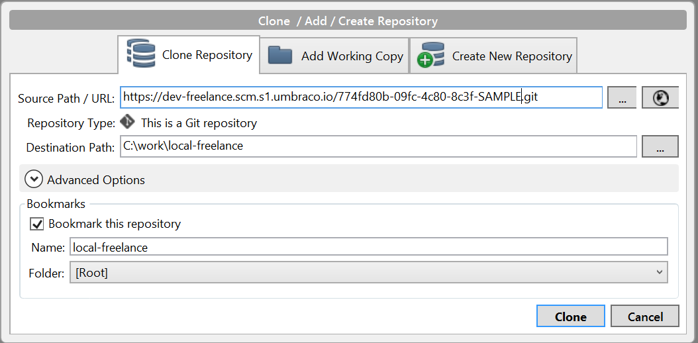
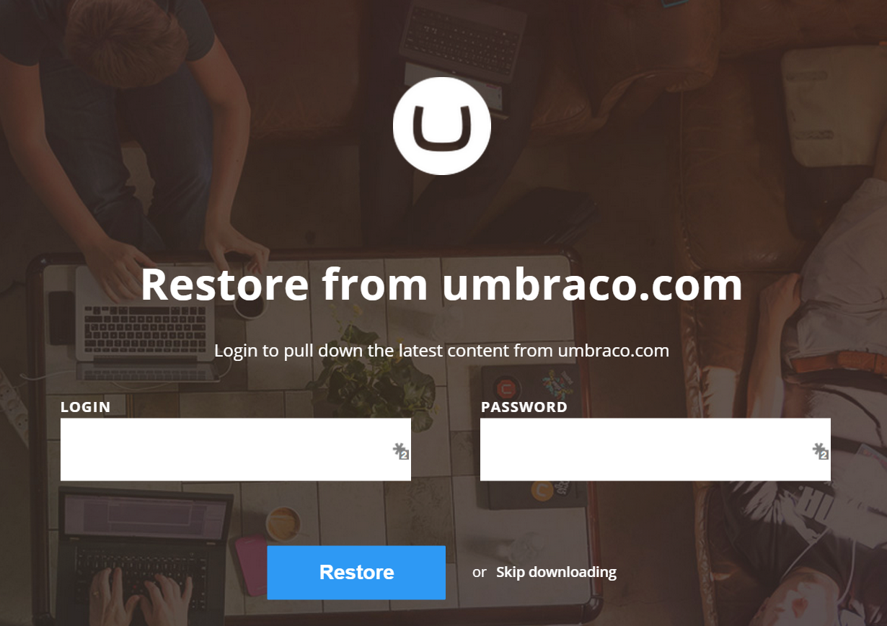

#Working with a local clone of an umbraco.com site
To work with a local copy of your site you'll need to use Windows and have a local web server installed (like WebMatrix).  If you're not using Windows you can still work with your site's files (Templates, Css, JS, etc...) but you'll need to deploy these to your development site before you can "see" your updates.  If you are using Windows, read on for how to work locally.

From the umbraco.com portal copy your development site’s git repository endpoint using the *Get Clone Url* and then clone the site using your favorite Git client.  We like [SourceTree](http://www.sourcetreeapp.com/) or [Git Extensions](http://code.google.com/p/gitextensions/).  We'll use SourceTree in this example.  Here are the steps to clone your site:

1. Copy the Clone Url from the portal for your dev site

2. From SourceTree select Clone/New and paste the Url in the Source Path box

3. Set your Destination Path to where you keep your local work
4. You’ll be prompted to log in, use the same credentials as you use for the portal
5. Click Clone

Now you have an exact copy of your umbraco.com dev site locally.  

We like to use Microsoft WebMatrix when working locally, but you can use Visual Studio or another development tool or web server of course.  When you run your local site for the first time you’ll be prompted to restore your site's content.  Wait until this process completes as it also creates the local SqlCE database for your site.

That's it!  Now you can work with your site locally just as with any other umbraco site.  You can create content, add media, even create your own custom code.  When you're ready to deploy your changes make sure to have a look at the [deployments](/Deployment/index.md) documentation.

Note:  If you have more than "a few" media items see our recommendations for working with [media in umbraco.com](media.md).  
